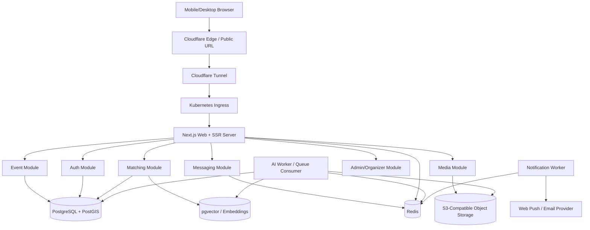

# ShowUp2Move Implementation and Build Plan

This document is the working implementation plan for ShowUp2Move: a responsive web application for spontaneous sports matching, event coordination, messaging, and social proof around attended activities.

The plan assumes one repository containing both client and server code. The web app should run well on phones, tablets, and desktop browsers. The production deployment should use a macOS-hosted Kubernetes environment, with server-side rendering and selected prerendering performed on the server for fast client startup.

## 1. Product Goals

ShowUp2Move helps users quickly find people nearby who want to play the same sport at a compatible time. The core loop is:

1. User creates an account and profile.
2. User selects sports, skill level, location preferences, and availability.
3. User responds to the recurring "ShowUpToday?" prompt.
4. System recommends nearby activities, compatible teammates, and auto-generated groups.
5. User joins or confirms an activity.
6. Group chat and event invitations help coordination.
7. Captain or organizer finalizes time, venue, price, and logistics.
8. Users attend, post pictures, and receive better recommendations over time.

## 2. Required Account Types

### Standard User

Main sports participant account.

Capabilities:

- Register, log in, manage profile.
- Add sports interests, preferred positions or play styles, skill level, and availability.
- Share approximate or precise location with privacy controls.
- View the map-first home screen.
- Join active or scheduled sports activities.
- Create manual events if permitted.
- Send and receive messages and event invitations.
- Post pictures from attended events with sport and date tags.
- Receive teammate recommendations and compatibility scores.

### Sports Event Organizer

Organizer account for people or venues who create and manage activities at scale.

Capabilities:

- Create verified organizer profile.
- Create and edit events, recurring sessions, venue listings, prices, capacity, rules, and cancellation policies.
- Invite users or groups.
- Manage participant approvals and waitlists.
- Open event-specific chats and announcements.
- Run polls for time, location, or teams.
- View event analytics: signups, attendance, cancellations, conversion from recommendations.
- Report incidents and moderate event-specific content.

### Administrator

Platform operations and safety account.

Capabilities:

- View and manage users, organizers, events, posts, reports, and chats.
- Approve or suspend organizer accounts.
- Moderate inappropriate images, posts, event descriptions, and messages.
- Manage sports taxonomy, supported cities, venue data, default group sizes, and feature flags.
- Review AI moderation and recommendation logs.
- View system health dashboards and audit logs.
- Handle support actions such as account recovery, bans, refunds if payments are added later, and data export/deletion requests.

## 3. Main User Experience

### Primary Home Screen

The main screen is a map-first interface.

Required elements:

- Full-screen interactive map as the primary surface.
- Activity markers for active and scheduled sports activities.
- Toggle to show active activities, scheduled activities, or both.
- Location-based sports activity cassettes/cards displaying:
  - activity image,
  - sport name,
  - distance,
  - time,
  - participant count,
  - skill range,
  - quick join or details action.
- Top-right friend activity cassette showing:
  - friend profile image,
  - sport activity they are attending,
  - distance between the user and friend/activity,
  - quick action to view or join.
- Bottom navigation bar with large circular buttons:
  - left-side main screens such as messages and events,
  - central Map button emphasized as the primary action,
  - right-side main screens such as profile and recommendations.
- Mobile-first gestures:
  - swipe activity cassette carousel,
  - tap marker to focus cassette,
  - bottom sheet for activity details,
  - location permission prompt only when needed.

Desktop adaptation:

- Map remains dominant.
- Activity cassettes can become a side panel.
- Bottom navigation can stay consistent or expand into a left rail if needed.
- Friend cassette stays visible in a non-overlapping position.

### Other Main Screens

- Messages: one-to-one chats, group chats, event-specific chats, event invitations.
- Events: upcoming, active, created, joined, past, waitlisted.
- Matching: ShowUpToday prompt, recommended groups, teammate suggestions.
- Profile: sports, skill, photos, availability, achievements, privacy.
- Organizer Dashboard: event creation, participant management, polls, announcements.
- Admin Dashboard: moderation, user management, platform settings, health.

## 4. Recommended Tech Stack

### Frontend and SSR

- Next.js App Router with TypeScript.
- React Server Components for server-rendered data-heavy screens.
- Partial prerendering or static prerendering for stable page shells where supported.
- Tailwind CSS for responsive styling.
- A map library such as Mapbox GL JS, MapLibre GL, or Google Maps JavaScript API.
- Client components only for interactive surfaces such as map gestures, live chat, location tracking, and media upload.

### Backend

Use Next.js route handlers for the hackathon MVP, with a clean domain/service layer that can later move into separate services if needed.

Core backend modules:

- Auth module.
- User/profile module.
- Sports taxonomy module.
- Availability module.
- Event module.
- Matching module.
- Messaging module.
- Notification module.
- Media/post module.
- AI profile enrichment module.
- Admin/organizer module.

For production maturity, keep these modules internally separated even if they run in one deployable web container at first.

### Data Stores

Recommended starting stack:

- PostgreSQL with PostGIS for users, events, posts, roles, availability, location queries, and transactional data.
- Redis for sessions, rate limits, queues, ephemeral matching state, and real-time presence.
- Object storage compatible with S3 for profile images and event/post media.
- Optional vector storage with pgvector for AI compatibility profiles and semantic matching.

PostgreSQL with PostGIS is preferred over a graph-only database for the first implementation because geospatial filtering, relational constraints, admin reporting, and hackathon maintainability are all first-class needs. A graph database can be added later if relationship traversal becomes complex.

### Real-Time Communication

Options:

- MVP: Socket.IO or WebSocket server in the Next.js runtime, backed by Redis adapter.
- More production-oriented: separate real-time service using Node.js, NestJS, or Fastify, still deployed in the same Kubernetes cluster.

The implementation should support:

- group chat,
- event-specific chat,
- event invitations in messages,
- typing indicators,
- presence,
- notifications/reminders,
- unread counts.

### AI

AI features should run asynchronously and never block critical user flows.

AI responsibilities:

- Extract sports/interests from profile descriptions.
- Extract signals from profile photos where permitted.
- Examine event posts and attended-event metadata.
- Build an internal user compatibility profile.
- Generate compatibility scores and teammate recommendations.
- Assist with content moderation and safety review.

Store AI-derived internal profile fields separately from user-visible profile fields. Make it clear in privacy settings that posts and profile content may be used for recommendations.

### Deployment and Operations

- Docker containers.
- Kubernetes on macOS server for orchestration and self-healing.
- NGINX Ingress or Traefik.
- Cloudflare Tunnel or equivalent for public URL access without router port forwarding.
- Kubernetes liveness, readiness, and startup probes.
- Horizontal Pod Autoscaler where supported.
- Structured logs and metrics.
- Secrets managed through Kubernetes Secrets or sealed/encrypted secret workflow.

## 5. Repository Structure

Recommended monorepo layout:

```text
showup2move/
  apps/
    web/
      src/
        app/
        components/
        features/
        lib/
        server/
        styles/
      public/
      next.config.ts
      package.json
  packages/
    database/
      prisma/
      migrations/
      seed/
    shared/
      src/
        types/
        validation/
        constants/
    config/
      eslint/
      tsconfig/
  infra/
    docker/
    k8s/
      base/
      overlays/
        local/
        production/
    scripts/
  docs/
    adr/
    api/
    design/
  README.md
  IMPLEMENTATION_BUILD_PLAN.md
  package.json
```

If the team wants a simpler hackathon structure, the `apps/web` folder can be the only app initially, while `packages/database` and `packages/shared` keep schema and shared validation separate.

## 6. High-Level Architecture



## 7. Server-Side Rendering and Prerendering Strategy

### Prerender on the macOS Server

The macOS server runs the Next.js container inside Kubernetes. The following should be server-rendered or prerendered:

- Public landing or intro page if one exists.
- Login/register page shell.
- Authenticated app layout shell.
- Initial map page chrome: navigation, user summary, stable labels, initial nearby activity query.
- Activity detail pages.
- Organizer event detail pages.
- SEO-friendly public event pages, if events can be public.

### Client-Side Hydration

Keep these as client components:

- Interactive map.
- Live location updates.
- Chat and typing indicators.
- Media upload progress.
- Real-time activity marker updates.
- Poll voting interactions.

### Performance Rules

- Render the first useful screen on the server.
- Dynamically import heavy map code.
- Cache nearby activity queries for short windows, for example 15 to 60 seconds.
- Use stale-while-revalidate for event details.
- Stream non-critical panels after the main shell loads.
- Keep map marker payloads compact.
- Use image optimization and responsive sizes for cassettes and posts.

## 8. Data Model Plan

Core entities:

- `User`: account identity and status.
- `UserRole`: user, organizer, admin.
- `Profile`: display name, bio, avatar, location privacy, preferences.
- `Sport`: sport taxonomy and default rules.
- `UserSportPreference`: sports, skill level, competitiveness, preferred roles.
- `Availability`: ShowUpToday responses and recurring availability windows.
- `Event`: manual or auto-generated sports activity.
- `EventLocation`: coordinates, address, venue metadata, distance support.
- `EventParticipant`: joined, invited, confirmed, waitlisted, attended, cancelled.
- `CaptainAssignment`: selected captain and assignment method.
- `OrganizerProfile`: verified organizer metadata.
- `Venue`: venue name, coordinates, price estimate, amenities, owner/organizer.
- `Poll`: event planning poll.
- `PollOption`: time/location/team/price options.
- `PollVote`: participant votes.
- `Conversation`: direct, group, or event-specific chat.
- `Message`: chat message.
- `EventInvitation`: invitation sent through messaging.
- `Notification`: reminders, invites, confirmations, system notices.
- `Post`: event-attendance media post.
- `PostMedia`: images/videos tied to a post.
- `AIUserProfile`: internal recommendation profile.
- `CompatibilityScore`: pair or group score snapshot with reason codes.
- `ModerationReport`: user-generated reports and AI moderation flags.
- `AuditLog`: admin and security-sensitive actions.

Important relationships:

- A user can have multiple sport preferences.
- An event has one sport and one primary location.
- An event can be created manually by a user, by an organizer, or automatically by the matching system.
- An event has one event-specific conversation.
- A post must reference an event the user attended.
- AI profile data references user-generated content but should be stored separately from public profile fields.

## 9. Matching and Recommendation Logic

### MVP Matching Inputs

- Sport preference.
- ShowUpToday response.
- Availability window.
- Distance from activity or candidate group.
- Skill level range.
- Group size requirements by sport.
- Existing participant count.
- Friend attendance.

### Advanced Matching Inputs

- Profile description embeddings.
- Sports/interests extracted from profile text.
- Signals from profile photo if the user permits.
- Attended-event history.
- Event post tags and image-derived activity signals.
- Reliability signals: confirmations, attendance, cancellations.
- Social graph: friends and previous teammates.
- Weather and venue availability.

### Matching Flow

1. Filter users by availability and sport.
2. Filter by distance and privacy constraints.
3. Group by compatible skill range and preferred intensity.
4. Apply group-size rules per sport.
5. Score candidates by compatibility.
6. Prefer groups with friends or previous positive teammates when appropriate.
7. Create auto-event draft when minimum viable group size is reached.
8. Assign captain.
9. Notify users.
10. Move group to confirmed event after enough users accept.

### Compatibility Score Components

Example score:

```text
compatibility =
  sport_match * 0.25 +
  availability_overlap * 0.20 +
  distance_score * 0.20 +
  skill_fit * 0.15 +
  social_affinity * 0.10 +
  reliability * 0.05 +
  AI_profile_similarity * 0.05
```

Keep reason codes for explainability:

- same sport,
- close distance,
- similar skill,
- friend attending,
- played together before,
- available now,
- compatible intensity.

## 10. Event Lifecycle

Statuses:

- Draft.
- Suggested.
- Open.
- Pending confirmation.
- Confirmed.
- Active.
- Completed.
- Cancelled.

Manual event creation:

1. User or organizer selects sport.
2. Adds location, time, capacity, image, description, price if relevant.
3. Chooses public, invite-only, or friends-only visibility.
4. Publishes event.
5. System creates event chat and map marker.
6. Users join, request to join, or receive invitations.

Auto-event setup:

1. Matching job finds compatible users.
2. System creates suggested event with tentative time and area.
3. Captain is randomly assigned or selected by reliability score.
4. Captain receives coordination tools.
5. Group votes on venue/time if needed.
6. Event becomes confirmed after threshold acceptance.

Organizer event creation:

1. Organizer uses dashboard to create single or recurring activity.
2. Adds venue, price, rules, max participants, image, skill level.
3. Optionally enables approval, waitlist, polls, or automatic team balancing.
4. Publishes to map and recommendations.

## 11. Messaging and Invitations

Messaging must include:

- Direct messages.
- Group messages for matched groups.
- Event-specific chat.
- Event invitation message type.
- Rich invitation preview:
  - sport,
  - image,
  - location,
  - time,
  - distance,
  - join/decline buttons.
- Real-time delivery where possible.
- Offline notification fallback.
- Abuse controls: block, report, mute, admin review.

Message types:

- Text.
- Event invitation.
- Poll prompt.
- System event update.
- Image attachment if time permits.

## 12. Social Posts and AI Profile Enrichment

Post requirements:

- User can post pictures only for events they attended.
- Post automatically shows sport activity name and event date tag.
- User can add caption and optional visibility.
- Posts appear on profile and optionally event recap.
- Organizer/admin moderation applies.

AI enrichment flow:

1. User creates or updates profile, avatar, or event post.
2. Background job queues analysis.
3. AI extracts safe recommendation signals.
4. System updates `AIUserProfile`.
5. Matching service uses internal profile for teammate recommendations.
6. Admin can review AI flags where moderation is involved.

Privacy rules:

- Never expose raw internal AI profile to other users.
- Allow users to opt out of AI-based recommendations where required.
- Do not use private messages for AI profile enrichment unless explicitly permitted.
- Store prompt inputs and outputs with minimal sensitive data.

## 13. Admin and Organizer Logic

### Admin Screens

- Dashboard overview: users, events, reports, system health.
- User management: search, view, suspend, restore, role assignment.
- Organizer approval queue.
- Event moderation: edit, hide, cancel, feature.
- Post/media moderation.
- Sports taxonomy editor.
- Venue data management.
- AI moderation review.
- Audit log viewer.

### Organizer Screens

- Organizer onboarding and verification.
- Event list and calendar.
- Event editor.
- Participant list, approvals, waitlist.
- Event chat announcements.
- Poll builder.
- Attendance check-in.
- Post-event summary.

Authorization:

- Use role-based access control.
- Enforce authorization server-side, not only in UI.
- Log every admin action in `AuditLog`.

## 14. Security Plan

Authentication:

- Secure email/password or OAuth login.
- Password hashing with a modern algorithm if passwords are stored.
- Session cookies should be `HttpOnly`, `Secure`, and `SameSite=Lax` or stricter.
- CSRF protection for cookie-authenticated mutations.

Authorization:

- Role-based access control for user, organizer, and admin.
- Object-level authorization for events, messages, posts, and media.
- Server-side checks on every mutation.

Input and data protection:

- Validate all requests with shared schemas.
- Sanitize user-generated text before rendering.
- Restrict uploaded file types and sizes.
- Scan or moderate uploaded media where possible.
- Use signed upload URLs for object storage.
- Never trust client-provided coordinates for sensitive decisions without reasonableness checks.

Abuse prevention:

- Rate-limit login, signup, messaging, event creation, invitations, and uploads.
- Add spam detection for repeated invites/messages.
- Provide block/report flows.
- Add admin review queues.

Secrets:

- No secrets in source control.
- Use `.env.example` only for variable names.
- Use Kubernetes Secrets in deployments.
- Rotate tokens used by Cloudflare Tunnel, object storage, and AI providers.

Compliance and privacy:

- Data export/delete path for users.
- Clear location privacy settings.
- Approximate location mode for matching.
- Explicit consent for photo/profile AI processing.

## 15. Stability and Performance Plan

Kubernetes self-healing:

- Liveness probes restart unhealthy containers.
- Readiness probes remove unhealthy pods from traffic.
- Startup probes protect slow initial boot.
- Use rolling deployments.
- Run at least two web replicas if the local cluster has enough resources.
- Separate worker process from web process if background AI or notification jobs become heavy.

Health endpoints:

- `/api/health/live`: process is alive.
- `/api/health/ready`: database, Redis, and critical dependencies reachable.
- `/api/health/startup`: app boot complete.

Performance:

- Server-render initial screens.
- Keep map payloads paginated and bounded by viewport.
- Use geospatial indexes.
- Cache common event and sport metadata.
- Queue AI processing.
- Use image thumbnails in map cassettes.
- Avoid loading chat history all at once.
- Add database indexes for `sportId`, `eventStatus`, `startsAt`, coordinates, participant status, and user role.

Observability:

- Structured JSON logs.
- Request IDs.
- Error tracking.
- Basic metrics:
  - request latency,
  - error rate,
  - active users,
  - matching job duration,
  - WebSocket connections,
  - message delivery failures,
  - queue depth.

## 16. Kubernetes Deployment Plan

Recommended workloads:

- `web`: Next.js SSR app.
- `worker`: background jobs for matching, notifications, AI analysis.
- `postgres`: local development database, or managed database for production.
- `redis`: cache, sessions, queues, presence.
- `ingress`: NGINX or Traefik.
- `cloudflared`: public tunnel.
- Optional `minio`: local S3-compatible object storage.

Required manifests:

```text
infra/k8s/base/
  namespace.yaml
  configmap.yaml
  secrets.example.yaml
  web-deployment.yaml
  web-service.yaml
  worker-deployment.yaml
  postgres-statefulset.yaml
  postgres-service.yaml
  redis-deployment.yaml
  redis-service.yaml
  ingress.yaml
  cloudflared-deployment.yaml
  hpa.yaml
  network-policies.yaml
```

Important Kubernetes rules:

- Do not bake secrets into images.
- Use resource requests and limits.
- Use persistent volumes for Postgres if self-hosted.
- Prefer managed Postgres for any real public deployment.
- Use readiness probes to avoid routing users to pods that cannot reach dependencies.
- Use separate probes for shallow liveness and deep readiness.

## 17. Development Stages

### Stage 0: Project Foundation

Goal: Create a working monorepo that builds locally.

Tasks:

- Create Next.js TypeScript app.
- Add Tailwind CSS and base responsive layout.
- Add linting, formatting, and strict TypeScript settings.
- Add `.env.example`.
- Add shared validation package.
- Add database package with migration tooling.
- Add Dockerfile for the web app.
- Add initial CI checks if using GitHub.

Deliverables:

- App starts locally.
- Type checking and linting pass.
- Initial Docker image builds.

### Stage 1: Database, Auth, Roles

Goal: Users can register and access role-specific views.

Tasks:

- Design database schema for users, roles, profiles, sports.
- Implement registration/login/logout.
- Add session handling.
- Add profile creation.
- Add role system: user, organizer, admin.
- Add protected route middleware.
- Seed sports and group-size rules.
- Add basic admin role assignment seed script.

Deliverables:

- User account flow works.
- Admin and organizer routes are protected.
- Profile data persists.

### Stage 2: Profile and Preferences

Goal: Users can describe themselves and define sports preferences.

Tasks:

- Build profile editor.
- Add profile photo upload.
- Add sport preference selector.
- Add skill level and play intensity.
- Add preferred radius and location privacy.
- Add availability windows.
- Add ShowUpToday one-click response.

Deliverables:

- Profiles support all scored profile requirements.
- ShowUpToday response is stored and visible.

### Stage 3: Map-First Main GUI

Goal: Build the main user screen described in the requirements.

Tasks:

- Implement full-screen responsive map shell.
- Add map provider integration.
- Add active/scheduled activity toggle.
- Add event markers.
- Add activity cassette carousel or panel.
- Add top-right friend activity cassette.
- Add large circular bottom navigation buttons with central Map button.
- Add mobile bottom sheet event details.
- Add desktop side panel adaptation.
- Use the rough Figma main screen once provided to refine layout, spacing, icons, and visual hierarchy.

Deliverables:

- Main screen is usable on mobile and desktop.
- Markers and cassettes are connected.
- Friend cassette displays nearest friend activity.

### Stage 4: Manual Events and Organizer Events

Goal: Users and organizers can create sports activities.

Tasks:

- Add event creation form.
- Add sport, image, location, date/time, capacity, skill range, description.
- Add organizer-specific fields: venue, price, recurrence, rules.
- Add event visibility modes.
- Add join/leave/request flow.
- Add participant list.
- Add event status lifecycle.
- Add event-specific chat creation on publish.

Deliverables:

- Manual event creation earns event coordination points.
- Organizer dashboard can create and manage events.
- Events appear on map and lists.

### Stage 5: Messaging, Chat, and Invitations

Goal: Participants can coordinate in real time.

Tasks:

- Add conversations and messages schema.
- Add direct messages.
- Add event-specific group chat.
- Add matched group chat.
- Add event invitation message type.
- Add invitation accept/decline flow.
- Add unread counts.
- Add WebSocket or Socket.IO integration.
- Add Redis adapter for multi-pod support.
- Add report/block/mute controls.

Deliverables:

- Group chat works.
- Event-specific chat works.
- Event invitation can be sent in messaging.
- Real-time updates work across browser sessions.

### Stage 6: Smart Matching MVP

Goal: Automatically generate useful groups.

Tasks:

- Implement sport and availability filtering.
- Implement group-size rules by sport.
- Implement proximity scoring with PostGIS.
- Implement skill compatibility.
- Implement match confirmation workflow.
- Implement captain assignment.
- Create matched group conversation.
- Notify matched users.
- Add matching debug/admin view for demos.

Deliverables:

- ShowUpToday users can be matched automatically.
- Groups respect sport size requirements.
- Captain is assigned.
- Confirmation workflow works.

### Stage 7: Venue Assistance and Polls

Goal: Captains and organizers can coordinate logistics.

Tasks:

- Add venue model.
- Add venue suggestions by sport and distance.
- Add price estimates.
- Add event polls for time/location/venue/team options.
- Add voting UI in event detail and chat.
- Add captain tools panel.
- Add event reminders.

Deliverables:

- Captains can select venues.
- Participants can vote.
- Pricing/options are shown.

### Stage 8: Social Posts and Attendance

Goal: Users can post attended event pictures with automatic tags.

Tasks:

- Add attendance confirmation/check-in.
- Add post creation restricted to attended events.
- Add event media upload.
- Add automatic sport and date tags.
- Add profile post feed.
- Add event recap feed.
- Add moderation/reporting.

Deliverables:

- Users can post event pictures.
- Posts show sport activity name and date.
- Only attended events can be tagged.

### Stage 9: AI Enhancements

Goal: Improve matching and score high in AI categories.

Tasks:

- Add AI job queue.
- Extract sports/interests from profile descriptions.
- Optionally analyze profile photos with user consent.
- Analyze attended-event posts for recommendation signals.
- Generate internal `AIUserProfile`.
- Add compatibility scoring service.
- Add teammate recommendations.
- Add admin AI moderation review for flagged content.
- Add explainable recommendation reason codes.

Deliverables:

- AI-derived profile improves recommendations.
- Compatibility scores are visible where useful.
- Teammate recommendations work.

### Stage 10: Bonus Features

Goal: Add high-value optional scoring features after the core works.

Recommended priority:

1. Weather-aware recommendations.
2. Calendar export or integration.
3. Team balancing by skill.
4. Gamification and achievements.
5. Social sharing/invites.
6. Multi-language support.
7. Wearables/fitness integrations.

Deliverables:

- Bonus features are demo-ready and do not destabilize the core.

### Stage 11: Admin, Safety, and Production Readiness

Goal: Make the platform safer and more stable.

Tasks:

- Complete admin dashboard.
- Add audit logs.
- Add moderation queues.
- Add rate limits.
- Add upload validation.
- Add privacy controls.
- Add observability.
- Add backups for database.
- Add smoke tests.
- Add load checks for map and chat endpoints.

Deliverables:

- Admin can operate the platform.
- Security risks are reduced.
- Demo is stable.

### Stage 12: Kubernetes and Public URL Deployment

Goal: Run the app on the macOS server with automatic recovery.

Tasks:

- Build production Docker image.
- Add Kubernetes namespace and manifests.
- Deploy Postgres, Redis, web, worker, ingress, and tunnel.
- Add liveness/readiness/startup probes.
- Add resource requests/limits.
- Add rolling update strategy.
- Add Cloudflare Tunnel or equivalent public URL.
- Test failure recovery by killing a pod and observing restart.
- Document deployment commands.

Deliverables:

- App is accessible from a browser URL.
- Kubernetes restarts failed services automatically.
- SSR/prerendering runs on the macOS server.

## 18. API Surface Plan

Initial REST-style route groups:

```text
/api/auth/*
/api/profile/*
/api/sports/*
/api/availability/*
/api/events/*
/api/events/:id/participants/*
/api/events/:id/polls/*
/api/events/:id/posts/*
/api/messages/*
/api/invitations/*
/api/matching/*
/api/recommendations/*
/api/uploads/*
/api/organizer/*
/api/admin/*
/api/health/*
```

Use shared request/response schemas. Keep API responses shaped for the UI, but do not expose internal AI profile fields directly.

## 19. Testing Plan

Unit tests:

- matching score calculation,
- group-size rules,
- role authorization helpers,
- event lifecycle transitions,
- invitation accept/decline,
- post attendance validation.

Integration tests:

- register/login/profile creation,
- event creation and join flow,
- ShowUpToday to match generation,
- message invitation flow,
- organizer event workflow,
- admin moderation action.

End-to-end tests:

- mobile map screen loads and markers appear,
- user joins event from map cassette,
- user receives event invitation in chat,
- organizer creates event,
- admin suspends event or user.

Deployment tests:

- Docker image builds.
- Kubernetes manifests apply.
- Health endpoints respond.
- Readiness fails when database is unavailable.
- Pod restarts after simulated crash.

## 20. Demo Plan

For hackathon judging, prepare a scripted demo:

1. Open public URL on desktop and mobile viewport.
2. Register user and complete profile.
3. Show map-first screen with nearby activities.
4. Toggle active and scheduled activities.
5. Open friend activity cassette.
6. Respond Yes to ShowUpToday.
7. Show automatic match and captain assignment.
8. Open event-specific chat.
9. Send an event invitation in messaging.
10. Vote on venue/time poll.
11. Organizer creates a new event.
12. User attends and posts picture with sport/date tag.
13. Show teammate recommendations and compatibility score.
14. Admin dashboard moderates or reviews platform activity.
15. Demonstrate Kubernetes self-healing by restarting or killing a pod and showing recovery.

## 21. Scoring Coverage Checklist

Use this checklist to verify that the build plan covers the README scoring categories.

| README category                      | Planned implementation                                               | Primary stage     |
| ------------------------------------ | -------------------------------------------------------------------- | ----------------- |
| Application runs successfully        | Next.js app, Docker build, local and Kubernetes deployment           | Stage 0, Stage 12 |
| Frontend/backend integration         | Route handlers, database layer, shared validation, live data screens | Stage 1 onward    |
| Clean architecture                   | Monorepo, domain modules, shared types, ADRs, tests                  | Stage 0 onward    |
| Responsive/mobile-friendly UI        | Map-first responsive layout, mobile bottom sheet, desktop panels     | Stage 3           |
| Registration/login                   | Auth, sessions, protected routes                                     | Stage 1           |
| Profile creation                     | Profile editor, avatar, bio, preferences                             | Stage 2           |
| Sports preferences                   | Sports taxonomy and user sport preferences                           | Stage 1, Stage 2  |
| Profile photo upload                 | Signed upload flow and media validation                              | Stage 2           |
| Skill level/preferences              | Skill, intensity, preferred radius, play style                       | Stage 2           |
| ShowUpToday availability             | One-click prompt and recurring availability                          | Stage 2           |
| Automatic sport matching             | Matching job and auto-event suggestions                              | Stage 6           |
| Description/interests matching       | AI text extraction and compatibility profile                         | Stage 9           |
| Group-size matching                  | Sport-specific min/max group rules                                   | Stage 6           |
| Proximity matching                   | PostGIS location queries and distance scoring                        | Stage 3, Stage 6  |
| Match confirmation                   | Invitation/acceptance workflow for suggested groups                  | Stage 6           |
| AI sports/interests from description | Profile AI analysis job                                              | Stage 9           |
| AI sports/interests from photo       | Optional consent-based image analysis                                | Stage 9           |
| AI compatibility scoring             | Compatibility service with explainable reason codes                  | Stage 9           |
| Teammate recommendations             | Recommendation screen and map/event suggestions                      | Stage 9           |
| Group chat                           | Real-time group conversations                                        | Stage 5           |
| Event-specific chat                  | Conversation created per event                                       | Stage 4, Stage 5  |
| Notifications/reminders              | Notification worker and reminder jobs                                | Stage 5, Stage 7  |
| Real-time updates                    | WebSocket/Socket.IO plus Redis adapter                               | Stage 5           |
| Captain assignment                   | Random or reliability-weighted captain selection                     | Stage 6           |
| Auto-event setup                     | Suggested event lifecycle from matching                              | Stage 6           |
| Manual event creation                | User and organizer event forms                                       | Stage 4           |
| Venue/location suggestions           | Venue model and location assistance                                  | Stage 7           |
| Price estimation                     | Venue price metadata and estimates                                   | Stage 7           |
| Voting/polling                       | Event polls and chat prompts                                         | Stage 7           |
| Maps/location assistance             | Map markers, cassettes, distance, directions hooks                   | Stage 3           |
| Calendar integration                 | Export or provider integration                                       | Stage 10          |
| Weather-aware recommendations        | Weather data in event recommendations                                | Stage 10          |
| Team balancing by skill              | Team assignment helper                                               | Stage 10          |
| Gamification/achievements            | Attendance streaks and badges                                        | Stage 10          |
| Multi-language support               | i18n routing and translation files                                   | Stage 10          |
| Social sharing/invites               | Share links and invite flows                                         | Stage 10          |
| Wearables/fitness integrations       | Optional provider integrations                                       | Stage 10          |
| Admin account and logic              | Admin dashboard, moderation, audit logs                              | Stage 11          |
| Organizer account and logic          | Organizer dashboard and event management                             | Stage 4, Stage 11 |
| Social posts from attended events    | Event-tagged posts with sport/date tags                              | Stage 8           |
| Kubernetes self-healing              | Probes, deployments, restart testing                                 | Stage 12          |
| Server-side prerendering             | Next.js SSR/prerendered page shells on macOS server                  | Stage 0, Stage 12 |

## 22. Architecture Decisions

### ADR-001: Use a Responsive Web App Instead of Native Mobile Apps

Status: Accepted.

Decision: Build a responsive Next.js web app that works on mobile and desktop browsers.

Rationale: The hackathon requires fast delivery, a public URL, and a shared codebase. A responsive web app gives broad device coverage with lower implementation cost.

Trade-off: Native mobile capabilities are limited compared with React Native or Swift/Kotlin apps, but web APIs are enough for the MVP.

### ADR-002: Use Server-Side Rendering for Initial User Experience

Status: Accepted.

Decision: Use Next.js SSR and prerender selected page shells on the macOS Kubernetes server.

Rationale: SSR improves perceived performance, supports fast first paint, and keeps sensitive data fetching on the server.

Trade-off: More deployment complexity than a static SPA, but it better matches the requirement for server-side prerendering.

### ADR-003: Use PostgreSQL with PostGIS as the Primary Database

Status: Recommended.

Decision: Use PostgreSQL plus PostGIS for transactional and location-based data.

Rationale: The product depends heavily on location queries, event relationships, roles, and reporting. PostGIS handles nearby activity search cleanly.

Trade-off: Graph-style recommendations may require additional modeling or pgvector, but this is simpler than operating both PostgreSQL and Neo4j for an MVP.

### ADR-004: Start Modular Monolith, Keep Service Boundaries Clear

Status: Accepted.

Decision: Start with a single web app and worker, organized by domain modules.

Rationale: A modular monolith is faster for a hackathon while still maintainable. Kubernetes can still restart the web, worker, Redis, and database containers independently.

Trade-off: Messaging and matching are not independently deployable at first. They can be extracted later if scale requires it.

### ADR-005: Use Kubernetes for Self-Healing and Public Deployment

Status: Accepted.

Decision: Containerize the app and run it on Kubernetes with probes and restart policies.

Rationale: This directly satisfies the requirement that failed services are detected and restarted without manual intervention.

Trade-off: Kubernetes adds operational complexity, so manifests should stay minimal and well documented.

## 23. AI Agent Implementation Rules

When AI agents implement this project, follow these rules:

- Do not skip the database schema and authorization model.
- Keep user, organizer, and admin permissions separate from the beginning.
- Implement server-side authorization even if the UI hides restricted buttons.
- Keep map data payloads small and viewport-bounded.
- Use background jobs for AI, notifications, and recurring matching.
- Add tests for matching, permissions, event lifecycle, and invitations.
- Treat uploads, location, chat, and AI processing as security-sensitive.
- Prefer simple working vertical slices over broad unfinished scaffolding.
- Keep every stage demoable.

## 24. Suggested Build Order for Fastest Scoring

Priority order:

1. Running app, clean architecture, responsive layout.
2. Auth, profile, sport preferences, skill levels, photo upload.
3. Map-first main screen with activity markers and cassettes.
4. Manual events, join flow, event details.
5. ShowUpToday and smart matching MVP.
6. Group chat, event chat, event invitations.
7. Captain assignment, venue suggestions, polls.
8. Organizer and admin dashboards.
9. Posts from attended events with sport/date tags.
10. AI profile enrichment, compatibility, teammate recommendations.
11. Kubernetes deployment, probes, public URL, self-healing demo.
12. Bonus features.

This order maximizes visible functionality and scoring coverage while keeping the project stable enough to demo.

## 25. Development Kickoff Checklist

Before writing feature code, complete these setup items:

1. Confirm the final tech stack and lock the major choices in this plan.
2. Create the repo structure for a monorepo with shared types, database schema, and web app code.
3. Decide the auth approach, role model, and session strategy.
4. Pick the primary database, location strategy, and object storage provider.
5. Define the sports taxonomy and default group sizes from the README scoring categories.
6. Prepare the initial data model for users, profiles, events, chat, and posts.
7. Create the environment variable contract for local development and Kubernetes.
8. Set up linting, formatting, type checking, and test commands before feature work starts.
9. Prepare the Figma handoff for the map-first home screen and responsive navigation.
10. Establish the CI pipeline for build, lint, typecheck, and tests.
11. Create the Kubernetes namespace, base manifests, and health endpoints early.
12. Verify the macOS server access path and public URL strategy before deployment work begins.
13. Decide which AI features are MVP and which are post-MVP so scope does not sprawl.
14. Write the server-side setup manual and keep it current as infrastructure choices change.

Server setup details, best practices, and deployment notes are documented in [SERVER_SIDE_SETUP_MANUAL.md](C:/Users/vmtan/Documents/GitHub/summer-practice-hackathon-2026/SERVER_SIDE_SETUP_MANUAL.md).
Practical step-by-step instructions for starting development on a Windows laptop and preparing the first vertical slice are documented in [DEVELOPMENT_BOOTSTRAP_GUIDE.md](C:/Users/vmtan/Documents/GitHub/summer-practice-hackathon-2026/DEVELOPMENT_BOOTSTRAP_GUIDE.md).
Very basic main mobile GUI mockup can be found in [rough_mobile_web_ui_reference.png](C:/Users/vmtan/Documents/GitHub/summer-practice-hackathon-2026/rough_mobile_web_ui_reference.png). You should plan out the rest of the logic and flow if necessary.
